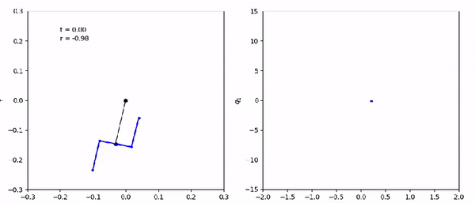

# rl-swing

Energy shaping is a significant topic in robotics. This project address this issue by explore the optimal control strategy for a human rider on a swing. TRPO is applied to both simulation and an Arduino robot.

## Requirements:

- Pytorch
- Numpy
- Scipy
- Cloudpickle
